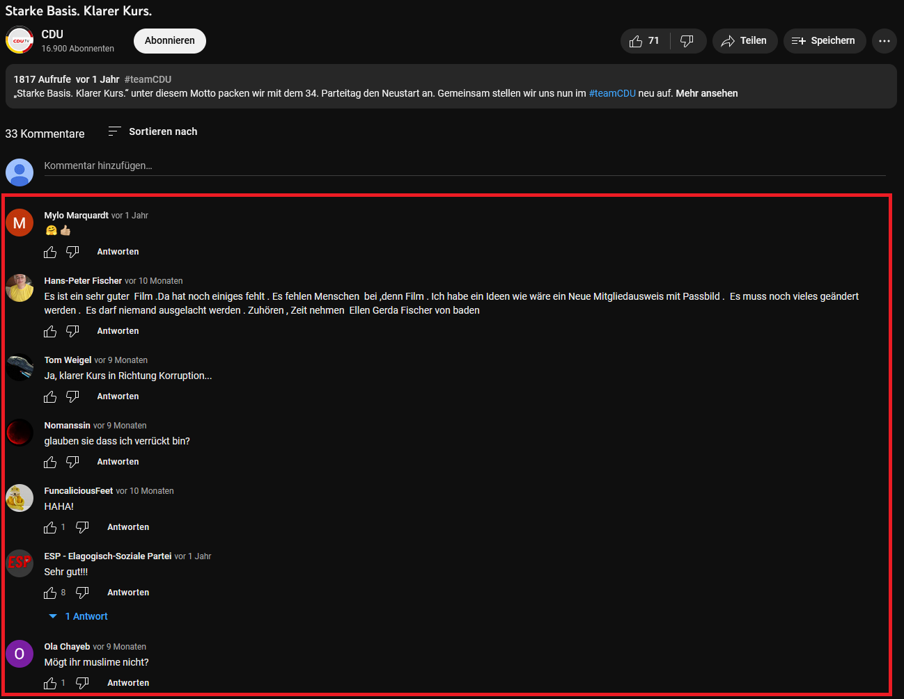

## Die YouTube API

[](https://developers.google.com/static/youtube/images/yt-data-api-search_720.png?hl=de)

Die **vollständige Dokumentation der YouTube API** findet ihr unter\
<https://developers.google.com/youtube/v3/docs>

## Vorteile der YouTube API

**Vorteile gegenüber Webscraping**

-   sauber formatierte, verlässliche Daten
-   legale, durch Terms of Service regulierte Datenbeschaffung
-   gute Dokumentation
-   *keine HTML-Kenntnisse nötig*
-   R-Packages zum Umgang mit der API, z.B. tuber

**Nachteile**

-   Mögliche Daten durch die Endpoints der API vorgegeben
-   Rate Limits reglementieren die täglich verfügbare Datenmenge
-   Authentifizierung via OAuth 2.0 / API Keys etwas umständlich

# Die YouTube API mit *R*

## Zugriff auf die YouTube API

Für den Zugriff auf die YouTube API verwenden wir das *R*-Paket *tuber*. Dieses erlaubt es uns, komfortabel YoutTube Daten zu ziehen und in einem für die weitere Verarbeitung geeigneten Format auszugeben. Dazu müssen wir zunächst das Paket installieren. Dabei gibt es jedoch ein Problem: seit dem letzten offiziellen Release des Pakets hat sich etwas an der YouTube API geändert und die Funktion, welche es erlaubt, die vorgeschlagenen Videos zu ziehen, funktioniert nicht mehr. Zum Glück ist das in der aktuellen Entwicklerversion des Pakets, die wir auf Github finden können, schon behoben. Das heißt allerdings, dass wir nicht wie gewohnt `install.packages()` verwenden können, sondern das Paket direkt von Github installieren müssen. Dazu benötigen wir die Funktion `install_git()` aus der *devtools* Library. Diese müssen wir zunächst installieren. mit `devtools::install_git()` können wir dann auf die benötigte Funktion zugreifen, ohne gleich die ganze Library laden zu müssen (wir brauchen nur einmal diese eine Funktion).

```{r}
install.packages("devtools")

devtools::install_github("soodoku/tuber", build_vignettes = TRUE) 
```

Nachdem wir die aktuelle Version von *tuber* installiert haben, können wir sie wie gewohnt laden. Außerdem werden wir wieder das *Tidyverse* und *lubridate* verwenden, die wir ebenfalls laden.

```{r}
library(tuber)
library(tidyverse)
library(lubridate)
```

Nun müssen wir zunächst eine sogenannte Authentifizierung durchführen, die dafür sorgt, dass die API unseren Zugang anerkennt. Dafür benötigen wir die **App ID** und das **App Secret**, die wir bereits letzte Woche erstellt haben. Fügt diese dazu einfach in den untenstehenden Code ein und führt ihn aus.

Ihr werdet zunächst gefragt, ob ihr eine lokale Datei erstellen wollt, um die Credentials zu speichern. Das ist komfortabel, da ihr den folgenden Prozess nicht jedesmal neu durchlaufen müsst, allerdings auch etwas fehleranfällig. Falls es ein Problem mit eurer Authentifizierung gíbt, müsst ihr die Datei ".httr-oauth" händisch löschen und die Funktion erneut ausführen. Ich würde empfehlen, hier "No" auszuwählen.

Danach öffnet sich euer Browser und ihr landet auf einer Authentifizierungsseite. Dort müsst ihr euch **mit dem Account einloggen, den ihr als Test Account in der App angegeben habt**. Danach stimmt ihr zu, dass ihr der Entwickler\*in (euch selbst) vertraut und Zugriff auf die API gewährt. Und fertig!

```{r}
yt_oauth(app_id = "xxxx",
         app_secret = "xxxx")
```

## Zugriff auf Metadaten von Videos

Testen wir zunächst anhand eines einzelnen Videos, ob unser Zugriff funktioniert. Das geht einfach mit der Funktion `get_video_details()`, die uns für eine Video ID die spezifizierten Metadaten zurückgibt. Die ID eines Videos findet ihr, wenn ihr ein Video auf YouTube aufruft, in der Adresszeile eures Browsers nach dem Schema: <https://www.youtube.com/watch?v=>**VIDEO_ID**

Wir wollen beispielsweise für die Regierungserklärung von Kanzler Scholz, das sogenannte `"snippet"`, also die Kurzinformationen zu Titel, Publikationsdatum, Beschreibung etc. Weitere Informationen zu den verfügbaren Daten findet ihr unter `?get_video_details()`. Außerdem können wir mit `as.data.frame = TRUE` spezifizieren, dass wir die Daten gerne als Dataframe hätten, bei dem eine Spalte einer Variable entspricht.

```{r}
video_data <- get_video_details(video_id = "6qSVM-APauo",
                                part = "snippet",
                                as.data.frame = TRUE)
```

Auf dieselbe Art und Weise können wir auch für mehrere Videos auf einmal Daten ziehen, indem wir einen Vector aus den IDs machen. Dann ist jede Reihe im Dataframe ein Video.

```{r}
video_data <- get_video_details(video_id = c("6qSVM-APauo", 
                                             "Q5z9QLrSLfQ", 
                                             "QyzZvzD8gD4"),
                                part = "snippet",
                                as.data.frame = TRUE)
```

## Zugriff auf Kommentare



Um auf Kommentare für einzelne Videos zuzugreifen, können wir die Funktion `get_all_comments()` verwenden, welche lediglich die Video ID benötigt. Beachtet, dass `get_all_comments()` allerdings nicht alle Antworten auf Kommentare ausgibt.

```{r}
comments <- get_all_comments(video_id = "6qSVM-APauo")
```

`get_all_comments()` kann jedoch immer nur die Kommentare für ein Video auf einmal ziehen. Wenn wir die Kommentare für mehrere Videos wollen, können wir dies entweder erreichen, indem wir die Funktion für jede Video ID einzeln ausführen. Eleganter ist es jedoch, einen **for-loop** zu verwenden. Dieser erlaubt es, in einer "Schleife" (einem Loop) durch alle Videos durchzugehen und die Kommentare der Videos jeweils mit `get_all_comments()` zu ziehen. Wir gehen also zwischen Reihe `1` und der Gesamtzahl der Reihen im Datensatz (`nrow(video_data)`) durch jeden Eintrag und füllen in den folgenden Operationen und Funktionen den Indikator `[i]` ein, welche je die aktuelle Reihe angibt. Diese einzelnen Dataframes, die so in jeder Runde des Loops erstellt werden, werden dann einem (anfangs leeren) Dataframe bzw. Tibble rundenweise hinzugefügt. Am Ende des Loops bauen wir mit `Sys.sleep()` eine kleine Pause ein. So "schläft" das System je eine Sekunde, bevor es mit dem nächsten Kanal weitergeht. Diese Pausen beugen Fehlermeldungen von APIs vor, die auftreten können, wenn wir zu schnell zu viele Anfragen stellen. In diesem Beispiel wollen die Kommentare von allen drei Videos erhalten, für die wir bereits die Metadaten gezogen haben.

```{r}
video_comments <- tibble() # leerer Container

for (i in 1:nrow(video_data)) {
  
  comments_per_video <- get_all_comments(video_data$id[i]) # API Call
  
  video_comments <-  bind_rows(video_comments, comments_per_video) # zusammenführen
  
  Sys.sleep(1) # Pausieren
}
```

Wir können genauso gut durch einen Vector loopen. In diesem Falle können wir statt `nrow()` die Funktion `length()` verwenden (ein Vektor hat keine Reihen, aber eine Länge, die durch die Anzahl der einzelnen Elemente bestimmt wird).

```{r}
ids <- c("6qSVM-APauo", # Vektor mit IDs
         "Q5z9QLrSLfQ",
         "QyzZvzD8gD4")

video_comments <- tibble() # leerer Container

for (i in 1:length(ids)) {
  
  comments_per_video <- get_all_comments(ids[i]) # API Call
  
  video_comments <-  bind_rows(video_comments, comments_per_video) # zusammenführen
  
  Sys.sleep(1) # Pausieren
}
```

**Ein wichtiger Hinweis zu for-loops in *R*:** im Gegensatz zu *Python*, das viele dieser und ähnlicher Loops verwendet, sind Loops in *R* nur selten eine gute Idee. Das liegt daran, dass sie, insbesondere für große Datensätze, schlecht skalieren und somit schnell sehr langsam und ineffizient werden. Daher sollten wir in *R* wann immer möglich Funktionen verwnden, die direkt auf dem Datensatz operieren, etwa aus dem *Tidyverse*. Dies macht es einfach, for-loops zu vermeiden. Dennoch gibt es eine begrenzte Anzahl an Fällen, in denen for-loops sinnvoll sind. Dies ist insbesondere der Fall bei API Calls, da wir bspws. mit `Sys.sleep()` kontrollieren können, wieviel Zeit zwischen den einzelnen Anfragen vergeht. Wenn wir alle Anfragen auf einmal stellen, kann es schnell passieren, dass unser Zugriff temporär gesperrt wird, um die API vor Überlastung zu schützen. Deshalb ist es oft sinnvoll, diese Art von Operationen nacheinander, eben in einem Loop, auszuführen.

## Vorgeschlagene Videos


Die Funktion `get_related_videos()` gibt uns die vorgeschlagenen Videos zu einem Video aus. Mit `max_results` geben wir die Anzahl an vorgeschlagenen Videos an, die wir pro Video erhalten möchten - bis zu 50 Stück. Es ist allerdings anzunehmen, dass nur weniger User\*innen mehr als 10 vorgeschlagene Videos überhaupt sehen. Wer scrollt schon lange durch diese Liste? Außerdem belastet es unser API Ratelimit relativ stark, die Daten dieser vogeschlagenen Videos zu ziehen (mehr dazu in der API Dokumentation). Deshalb entscheiden wir uns, nur 10 vorgeschlagene Videos zu ziehen:

```{r}
related_videos <- get_related_videos("6qSVM-APauo",
                                     max_results = 10)
```

Wenn wir die vorgeschlagenen Videos für mehr als ein Video ziehen wollen, müssen wir erneut einen for-loop verwenden. Die Video ID gibt dabei an, welches das "originale" Video ist, von dem wir ausgegangen sind. Da `get_related_videos()` uns automatisch einen kurzen Text dazu ausgibt, wieviele Videos gefunden wurden, benutzen wir diesmal außerdem `cat()` um in jeder Schleife ebenfalls einen kleinen Printout hinzuzufügen. Dieser besteht aus der ID des aktuellen Videos und einem Absatz. Somit können wir immer sehen, zu welchem Video wieviele Ergebnisse gefunden wurden.

```{r}

ids <- c("6qSVM-APauo", # Vektor mit IDs
         "Q5z9QLrSLfQ",
         "QyzZvzD8gD4")

more_related_videos <- tibble()

for (i in 1:length(ids)) {
  
  cat(ids[i], "\n")
  
  try({
    
    related_videos_per_video <- get_related_videos(ids[i], max_results = 10) 
    
    more_related_videos <- bind_rows(more_related_videos, related_videos_per_video)
    
    Sys.sleep(1)
    
  })
  
}
```

## Zugriff auf alle Videos eines Kanals

Wollen wir die Metadaten aller Videos eines Channels auf einmal ziehen, brauchen wir zunächst die Channel ID. Diese ist leider nicht ganz so leicht zu finden wie die Video ID. Wenn ihr mit dem Browser auf die YouTube Seite eines Kanals geht, müsst ihr euch den Seitenquelltext anzeigen lassen (mit Firefox bspws. via Rechtsklick). Daraufhin seht ihr den HTML-Code der Seite. Darin versteckt sich die Channel ID: sucht mit `str+f` nach "*channel_id=*". Daraufhin solltet ihr einen Abschnitt im Code entdecken, der euch die Channel ID verrät, bspws. *channel_id=UC7TAA2WYlPfb6eDJCeX4u0w* für die Grünen.

Diese Channel ID können wir dann mit der Funktion `list_channel_videos()` alle Videos eines Channels aus, bis zu der maximalen Anzahl die wir mit `max_results` festlegen. Wir können `Inf` (für Infinite, also unendlich) angeben, um alle Ergebnisse zu erhalten.

```{r}
gruene_videos <- list_channel_videos(channel_id = "UC7TAA2WYlPfb6eDJCeX4u0w",
                                     max_results = Inf)
```

Wir bekommen die Videos erneut in einem praktischen Dataframe, wenn auch mit etwas weniger Informationen als vorher. Da wir jedoch die video IDs aller Videos erhalten haben, könnten wir diese erneut an `get_video_details()` geben, um mehr Informationen zu erhalten. Ich mache dies einmal testweise für die ersten 5 Einträge in der Spalte *contentDetails.videoID* aus unserem Dataframe mit grünen Video. Dazu verwende ich eine sogenannten **Index**, welcher zwischen den eckigen Klammern steht: `[1:5]` wählt die Einträge 1 bis 5 aus, `[5]` den fünften Eintrag, ein weglassen des Index wählt alle Einträge aus. `$` spezifiziert die Spalte eines Dataframes.

```{r}
some_video_data <- get_video_details(video_id = gruene_videos$contentDetails.videoId[1:5],
                                     part = "snippet",
                                     as.data.frame = TRUE)
```

Um einen Überblick über die veröffentlichten Videos zu erhalten, können wir nun wieder das *Tidyverse* und *ggplot* verwenden, um Daten zu manipulieren und zu visulisieren. Es gibt jedoch ein Problem: Die Variabale *contentDetails.publishedAt*, also der Publikationszeitpunkt, ist eine Character-Variable (also einfach Zeichen). Das kann später Probleme machen, da viele Funktionen eine Variable im Datums-Format (POSIXct) erwarten. Mit `mutate()` können wir das allerdings leicht beheben. Die *lubridate*-Funktion `ymd_hms()` wandelt den Character String jeder Reihe in einen Datums-String nach dem Format **Y**ear-**M**onth-**D**ay\_**H**our-**M**inute**-S**econd um:

```{r}
gruene_videos <- gruene_videos %>% 
  mutate(contentDetails.videoPublishedAt = ymd_hms(contentDetails.videoPublishedAt))
```

Jetzt können wir beispielsweise einfach die Videos über Zeit plotten, indem wir sie zunächst mit `summarise()`wöchentlich akkumulieren:

```{r}
gruene_videos %>% 
  mutate(week = floor_date(contentDetails.videoPublishedAt, unit = "week")) %>% 
  summarise(videos = n(), .by = week) %>% 
  ggplot(aes(x = week, y = videos)) +
  geom_line()
```

### 

# Übungen

**Ihr seid dran:** Wiederholt die obigen Schritte für Videos, die für eure Forschungsfrage relevant sind. Falls ihr die Metadaten oder IDs aller Videos mehrerer Kanäle ziehen wollt, findet ihr unten Beispielcode. Dort findet ihr auch Hinweise und Code, um die in der Einführungspräsentation vorgestellten Fallbeispiele zu replizieren.

## 1. Metadaten

Zieht euch die Metadaten eines oder mehrerer Videos.

```{r}

```

## 2. Kommentare

Zieht euch die Kommentare für die Videos, die ihr für 1. bereits nachgeschlagen habt.

```{r}

```

## 3. Vorgeschlagene Videos

Zieht die ersten 10 vorgeschlagenen Videos für eure Videos. Hinweis: Wenn ihr sehr viele Videos nachschlagt, kann dies zum Erreichen des Ratelimits führen. Zum Umgang damit findet ihr am Ende dieses Dokuments (Abschniit "Vorgeschlagene Videos zu Parteivideos") Informationen. Für Übungszwecke reicht es, wenn ihr für maximal 10 Videos die vorgeschlagenen Videos zieht.

```{r}

```

## 4. Analyse

Analysiert eure Ergebnisse:

1.  Lasst euch die Anzahl an Kommentare pro Video mit `summarise()` zusammenfassen
2.  Visualisiert die Menge an Kommentaren über Zeit (ggf. pro Video)
3.  Lasst euch das durschnittliche Publikationsdatum der vorgeschlagenen Videos pro Ausgangsvideo ausgeben

```{r}
video_comments %>% summarise(count = n(), .by = videoId)
```

```{r}
write_csv(video_comments, "video_comments.csv")

write_csv(related_videos, "related_videos.csv")

write_csv(video_data, "video_data.csv")
```

# Replikation der Fallbeispiele

## Fallbeispiel: Youtube Kanäle der Parteien

Das Fallbeispiel aus der Präsentation sind die YouTube Kanäle der großen deutschen Parteien . Für eure eigenen Projekte könnt ihr natürlich alle anderen Kanäle verwenden. In diesem Abschnitt findet ihr Code, um das Beispiel zu reproduzieren oder (mit leichten Änderungen) auf andere Kanäle anzuwenden.


Wenn wir die Videos mehrerer Kanäle ziehen wollen, sollten wir zunächst die Channel IDs (händisch) heraussuchen und ablegen. Da ich außerdem vermerken will, welche Partei zu welchem Channel gehört, lege ich dazu eine tibble, also eine Art Dataframe, an:

```{r}
party_channels <- tibble(
  party = c("cdu",
            "spd",
            "gruene",
            "fdp", 
            "afd", 
            "linke"),
  channel_id = c("UCKyWIEse3u7ExKfAWuDMVnw",
                 "UCSmbK1WtpYn2sOGLvSSXkKw",
                 "UC7TAA2WYlPfb6eDJCeX4u0w",
                 "UC-sMkrfoQDH-xzMxPNckGFw",
                 "UCq2rogaxLtQFrYG3X3KYNww",
                 "UCA95T5bSGxNOAODBdbR2rYQ")
)
```

Um jetzt auf alle Kanäle zuzugreifen, kann ich einen sogannten **for-loop** verwenden. Dieser erlaubt es, in einer "Schleife" (einem Loop) durch alle Kanäle durchzugehen und die Metadaten der Videos jeweils mit `list_channel_videos()` zu ziehen. Wir gehen also zwischen Reihe `1` und der Gesamtzahl der Reihen im Datensatz (`nrow(party_channels)`) durch jeden Eintrag und füllen in den folgenden Operationen und Funktionen den Indikator `[i]` ein, welche je die aktuelle Reihe angibt. So fügen wir außerdem den Partei-Indikator der aktuellen Reihe zu unserem Ergebnis hinzu. Diese einzelnen Dataframes, die so in jeder Runde des Loops erstellt werden, werden dann einem (anfangs leeren) Dataframe bzw. Tibble rundenweise hinzugefügt. Außerdem nutzen wir `cat()` für einen kleinen Printout, der uns verrät, für welche Partei wir wie viele Videos erhalten. Das ist aber nicht unbedingt nötig. Am Ende des Loops bauen wir mit `Sys.sleep()` eine kleine Pause ein. So "schläft" das System je eine Sekunde, bevor es mit dem nächsten Kanal weitergeht. Diese Pausen beugen Fehlermeldungen von APIs vor, die auftreten können, wenn wir zu schnell zu viele Anfragen stellen.

**Ein wichtiger Hinweis zu for-loops in *R*:** im Gegensatz zu *Python*, das viele dieser und ähnlicher Loops verwendet, sind Loops in *R* nur selten eine gute Idee. Das liegt daran, dass sie, insbesondere für große Datensätze, schlecht skalieren und somit schnell sehr langsam und ineffizient werden. Daher sollten wir in *R* wann immer möglich Funktionen verwnden, die direkt auf dem Datensatz operieren, etwa aus dem *Tidyverse*. Dies macht es einfach, for-loops zu vermeiden. Dennoch gibt es eine begrenzte Anzahl an Fällen, in denen for-loops sinnvoll sind. Dies ist insbesondere der Fall bei API Calls, da wir bspws. mit `Sys.sleep()` kontrollieren können, wieviel Zeit zwischen den einzelnen Anfragen vergeht. Wenn wir alle Anfragen auf einmal stellen, kann es schnell passieren, dass unser Zugriff temporär gesperrt wird, um die API vor Überlastung zu schützen. Deshalb ist es oft sinnvoll, diese Art von Operationen nacheinander, eben in einem Loop, auszuführen.

```{r}
party_videos <- tibble() # empty container object to fill

# loop through every row in the dataframe of party channels
for (i in 1:nrow(party_channels)) { 
  # make the API call
  videos <-  list_channel_videos(
    channel_id = party_channels$channel_id[i],
    max_results = Inf)
  # add party indicator
  videos <- videos %>% mutate(party = party_channels$party[i]) 
  # bind results
  party_videos <- bind_rows(party_videos, videos) 
  # some printout to keep track
  cat(party_channels$party[i], ": ", 
      nrow(videos), 
      " videos retrieved \n", 
      sep = "") 
  # a sleep period between calls to avoid API errors
  Sys.sleep(1) 
  
}

```

Erneut wollen wir die Variable *contentDetails.videoPublishedAt* in ein richtiges Datum-Format umwandeln. Außerdem können wir mit `distinct()` sicherstellen, dass wir keine Duplikate in unseren Daten haben, indem wir nach einzigarten Video IDs filtern. Außerdem wollen wir noch ein "Label" für die Parteien, also einen Parteiindikator für grafische Darstellungen etc., der den kompletten (und korrekt geschriebenen) Parteinamen enthält. Dieses "data cleaning" ist ein wichtiger Bestandteil der Datenverarbeitung, der dafür sorgt, dass wir für unsere Analysen saubere Daten zur Verfügung haben. Nur so können wir gute Resultate erhalten!

```{r}
party_videos <- party_videos %>% 
  mutate(contentDetails.videoPublishedAt = ymd_hms(contentDetails.videoPublishedAt)) %>%  
  distinct(contentDetails.videoId, .keep_all = T) %>% 
  mutate(party_label = case_when( 
    party == "afd" ~ "AfD",
    party == "cdu" ~ "CDU",
    party == "spd" ~ "SPD",
    party == "fdp" ~ "FDP",
    party == "gruene" ~ "Bündnis 90/Die Grünen",
    party == "linke" ~ "DIE LINKE"
  ))
```

Nachdem wir diese Schritte durchgeführt haben, haben wir denselben *party_videos* Datensatz produziert, den ihr auch im Learnweb findet. In der vorherigen Übung habt ihr bereits den Code kennengelernt, der uns eine hübsche Übersicht über die Parteivideos über Zeit generiert:

```{r}
colors <-
  c(
    "AfD" = rgb(0, 60, 145, maxColorValue = 255),
    "CDU" = rgb(50, 48, 46, maxColorValue = 255),
    "DIE LINKE" = rgb(182, 28, 62, maxColorValue = 255),
    "FDP" = rgb(255, 237, 0, maxColorValue = 255),
    "Bündnis 90/Die Grünen" = rgb(70, 150, 43, maxColorValue = 255),
    "SPD" = rgb(227, 0, 15, maxColorValue = 255)
  )

party_videos %>% 
  mutate(month = floor_date(contentDetails.videoPublishedAt, unit = "month")) %>% 
  summarise(videos = n(), .by = c(month, party_label)) %>% 
  ggplot(aes(x = month, y = videos, color = party_label)) +
  geom_line() +
  facet_wrap( ~ party_label, ncol = 3) +
  guides(color = "none") +
  scale_color_manual(values = colors) +
  labs(
    x = "Monat",
    y = "Veröffentlichte Videos",
    color = "Partei",
    title = "Videos über Zeit nach Partei, Gesamtzeitraum"
  ) +
  theme_bw()
```

## Kommentare zu Parteivideos

Wenn wir nun die Kommentare der Parteivideos ziehen wollen, sollten wir zuerst den Beobachtungszeitraum einschränken. Ansonsten kann es leicht passieren, dass wir, wenn wir für alle 13.512 Videos Metadaten ziehen, an das Rate Limit der API geraten und einen Tag warten müssen, bevor wir weiterarbeiten können (zum Umgang damit später mehr). Deshalb wollen wir uns exemplarisch auf die im Januar 2022 veröffentlichen Videos beschränken. Dazu schränken wir zunächst mit `filter()` den Datensatz ein:

```{r}
videos_january <- party_videos %>% 
  filter(contentDetails.videoPublishedAt >= ymd("2022-01-01") & 
         contentDetails.videoPublishedAt < ymd("2022-02-01")) 

```

Daraufhin gehen wir ähnlich vor wie für die Kanäle, indem wir einen for-loop verwenden:

```{r}
comments_january <- tibble() # empty container

for (i in videos_january$contentDetails.videoId) { 
  # note how we can loop directly over the contents of this list, rather than using i in 1:nrow(videos_january) and accessing the content later through videos_january$contentDetails.videoId[i]
  
  comments <- NULL # this is only necessary to indicate missing / erroneous API calls correctly (otherwise we could just overwrite it every loop)
  
  cat(i, "\n")
  
  
  try({  # wrapping the call in try() makes sure the loop continues when an API call fails. Wrapping bind_rows() as well _after_ the call makes sure rows are only bound if comments are retrieved
    
      comments <- get_all_comments(video_id = i) # make API call
    
      comments_january <- bind_rows(comments_january, comments) # bind results
      
  })
  
  if(!is.null(comments)) {cat(nrow(comments), "comments retrieved\n")} # some output to keep track
  else {cat("no results \n")}
    
  Sys.sleep(1) # a sleep period between calls to avoid API errors
}
```

Jetzt fehlt uns allerdings ein Indikator, welches Video (und damit welche Kommentare) zu welcher Partei gehört. Einen solchen Indikator konnten wir auch nicht im Loop selbst erstellen, da wir diesmal nicht über die Reihen, sondern über die Werte einer Variable geloopt haben. Mit der Funktion `left_join()` können wir allerdings einfach die Werte aus einem anderen Datensatz hizufügen. Bei dieser Gelegenheit nehmen wir außerdem noch ein wenig Datacleaning vor:

```{r}
party_comments_january <- 
  left_join(videos_january, 
            comments_january %>% # join the comments on the video list...
              select(videoId, textDisplay, textOriginal, authorDisplayName, 
                     likeCount, publishedAt, id) %>%  # ... but select relevant data first.. 
              rename(comment_id = id),    # ... and rename the ID variable for clarity
            # we need to specify that the IDs have different column names in the two datasets
            by = join_by(contentDetails.videoId == videoId), 
            multiple = "all") %>%  # we expect multiple matches from the right-hand side (comments_january) to the left-hand side (videos_january)
  mutate(likeCount = as.integer(likeCount),              # count as integer, not character
         publishedAt = ymd_hms(publishedAt)) %>%       # proper dateteime format
  rename(video_id = contentDetails.videoId,              # rename some variables for clarity
         video_PublishedAt = contentDetails.videoPublishedAt,
         comment_PublishedAt = publishedAt) %>% 
  select(!c(kind, etag, id))   # drop some unnecessary variables
```

Jetzt können wir uns mit etwas zusätzlichem Datawrangling eine Überblicksstatistik ausgeben lassen:

```{r}
party_comments_january %>% group_by(party_label) %>% 
  # count non-missing and missing comments
  count(!is.na(comment_id), .drop = F) %>% 
  # wrangle into wide format
  pivot_wider(names_from = `!is.na(comment_id)`, values_from = n) %>%   
   # rename variables for clarity
  rename(comments = "TRUE", videos_without_comments = "FALSE") %>%  
  # replace NA values with 0
  replace_na(list(comments = 0, videos_without_comments = 0)) %>%        
  left_join(videos_january %>% group_by(party_label) %>% summarise(total_videos = n()), by = "party_label") %>%  # add total number of videos through another dataframe
  mutate(average_comments_per_video = comments / total_videos)   # get relative comments
```

## Vorgeschlagene Videos zu Parteivideos

Um die vorgeschlagenen Videos zu den Parteivideos aus dem Januar 2022 zu erhalten, können wir analog zu dem Beispiel oben vorgehen. Da wir jedoch relativ viele Videos nachschauen wollen, können wir an das Ratelimit der API stoßen. In diesem Fall würden wir das Ergebnis abspeichern und, nachdem das Ratelimit zurückgesetzt wurde (idR. am nächsten Tag), die verbliebenen Videos nachschlagen:

```{r}
related_videos_january <- tibble()

for (id in videos_january$contentDetails.videoId) {
  
  cat(id, "\n")
  
  try({
    
    related_videos <- get_related_videos(id, max_results = 10) # top 10 - we can assume most people won't scroll further, and this is less taxing on the rate limits than e.g. 50
    
    related_videos_january <- bind_rows(related_videos_january, related_videos)
    
    Sys.sleep(1)
    
  })
  
}

saveRDS(related_videos_january, "related_videos_january_pt1.RDS")

# if we hit an API rate limit, we have to wait for it to refresh and resume the collection

related_videos_january <- readRDS("related_videos_january_pt1.RDS")

missing_related_videos <- videos_january %>% anti_join(related_videos_january, by = join_by(contentDetails.videoId == video_id)) # an anti_join is an easy way to return all videos without a match in the related_video data


for (id in missing_related_videos$contentDetails.videoId) {
  
  cat(id, "\n")
  
  try({
    
    related_videos <- get_related_videos(id, max_results = 10) # top 10 - we can assume most people won't scroll further, and this is less taxing on the rate limits than e.g. 50
    
    related_videos_january <- bind_rows(related_videos_january, related_videos)
    
    Sys.sleep(1)
    
  })
  
}

saveRDS(related_videos_january, "related_videos_january.RDS")
```
