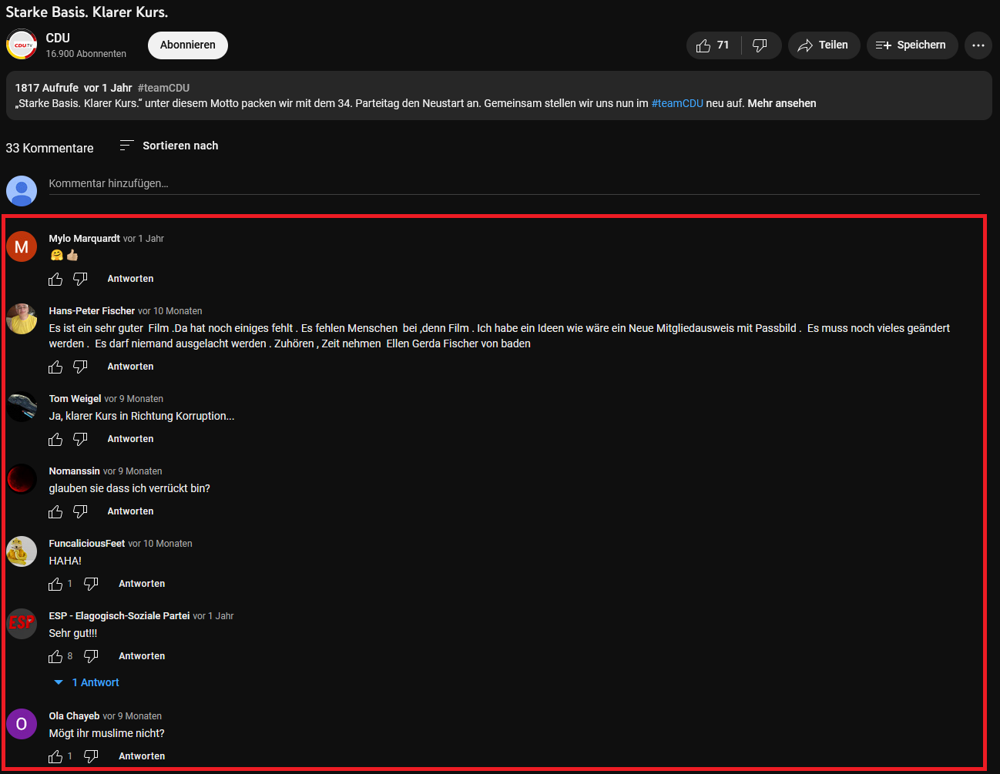

```{r setup, include=FALSE}
knitr::opts_chunk$set(echo = F, warning = F, out.width="80%", out.height="80%")
{
  library(tidyverse)
  library(tuber) # this potentially needs replacing with my last pull request if the bug fix is not implemented until then
  library(lubridate)
  library(igraph)
  library(ggraph)
}

party_videos <- readRDS("data/party_videos.RDS")
comments_january <- readRDS("data/comments_january.RDS")
related_videos_january <- readRDS("data/related_videos_january.RDS")

party_videos <- party_videos %>% # some data cleaning
  mutate(contentDetails.videoPublishedAt = ymd_hms(contentDetails.videoPublishedAt)) %>%  # proper datetime format
  distinct(contentDetails.videoId, .keep_all = T) %>% # make sure there are no duplicates
  mutate(party_label = case_when( # add some proper party labels
    party == "afd" ~ "AfD",
    party == "cdu" ~ "CDU",
    party == "spd" ~ "SPD",
    party == "fdp" ~ "FDP",
    party == "gruene" ~ "Bündnis 90/Die Grünen",
    party == "linke" ~ "DIE LINKE"
  ))

colors <-
  tibble(
    Partei = c(
      "AfD",
      "CDU",
      "CSU",
      "DIE LINKE",
      "FDP",
      "Bündnis 90/Die Grünen",
      "SPD"
    ),
    # a tibble storing the correct party colors
    Farbe = c(
      rgb(0, 60, 145, maxColorValue = 255),
      rgb(50, 48, 46, maxColorValue = 255),
      rgb(98, 180, 255, maxColorValue = 255),
      rgb(182, 28, 62, maxColorValue = 255),
      rgb(255, 237, 0, maxColorValue = 255),
      rgb(70, 150, 43, maxColorValue = 255),
      rgb(227, 0, 15, maxColorValue = 255)
    )
  )

videos_january <- party_videos %>% filter(contentDetails.videoPublishedAt >= ymd("2022-01-01"), contentDetails.videoPublishedAt < ymd("2022-02-01")) # filter by publication dates

party_comments_january <- left_join(videos_january, 
                                    comments_january %>% # join the comments on the video list...
                                      select(videoId, textDisplay, textOriginal, authorDisplayName, likeCount, publishedAt, id) %>%  # ... but select relevant data first ...
                                      rename(comment_id = id),    # ... and rename the ID variable for clarity
                                    by = join_by(contentDetails.videoId == videoId), # we need to specify that the IDs have different column names in the two datasets
                                    multiple = "all") %>%  # we expect multiple matches from the right-hand side (comments_january) to the left-hand side (videos_january)
  mutate(likeCount = as.integer(likeCount),              # count as integer, not character
         publishedAt = ymd_hms(publishedAt)) %>%       # proper dateteime format
  rename(video_id = contentDetails.videoId,              # rename some variables for clarity
         video_PublishedAt = contentDetails.videoPublishedAt,
         comment_PublishedAt = publishedAt) %>% 
  select(!c(kind, etag, id))                             # drop unnecessary variables

```

# Zugriff auf die YouTube API

## Die YouTube API

```{r, echo=FALSE, fig.cap="https://developers.google.com/static/youtube/images/yt-data-api-search_720.png?hl=de", out.height="100%", out.width="100%"}
knitr::include_graphics("yt-data-api-search_720.png")
```

## Vorteile der YouTube API

**Vorteile gegenüber Webscraping**

-   sauber formatierte, verlässliche Daten
-   legale, durch Terms of Service regulierte Datenbeschaffung
-   gute Dokumentation
-   *keine HTML-Kenntnisse nötig*
-   R-Packages zum Umgang mit der API, z.B. tuber

**Nachteile**

-   Mögliche Daten durch die Endpoints der API vorgegeben
-   Rate Limits reglementieren die täglich verfügbare Datenmenge
-   Authentifizierung via OAuth 2.0 / API Keys etwas umständlich

## Fallbeispiel: Youtube Kanäle der Parteien

```{r, echo=FALSE, fig.cap="", out.width="85%", out.height="85%"}
knitr::include_graphics("party_channels.png")
```

## Alle Videos der Parteien

```{r, echo = F}
party_videos %>% mutate(month = floor_date(contentDetails.videoPublishedAt, unit = "month")) %>% # make month indicator
  group_by(party_label, month) %>% reframe(videos_published = n()) %>%  # aggregate by party and month
  ggplot() +                                                            # initiate ggplot on the wrangled data
  geom_line(aes(x = month, y = videos_published, color = party_label)) +   # draw a line plot
  scale_color_manual(values = pivot_wider(colors, names_from = Partei, values_from = Farbe) %>% unlist()) + # add the manual party colors
  facet_wrap( ~ party_label, ncol = 3) +                              # facet by party (each has its own plot)
  labs(                                                               # make some proper labels to improve readability for audiences
    x = "Monat",             
    y = "Veröffentlichte Videos",
    color = "Partei",
    title = "Videos über Zeit nach Partei, Gesamtzeitraum"
  ) +
  guides(color = "none") + # drop the legend
  theme_bw()
```

# Netzwerkanalyse: YouTube als Diskursraum

## Videokommentare

```{r, echo=FALSE, fig.cap="", out.width="85%", out.height="85%"}

```

## Youtube-Kommentare zu Parteivideos, Januar 2022

```{r, echo=F}
party_comments_january %>% group_by(party_label) %>% 
  count(!is.na(comment_id), .drop = F) %>%                               # count non-missing and missing comments
  pivot_wider(names_from = `!is.na(comment_id)`, values_from = n) %>%    # wrangle into wide format
  rename(comments = "TRUE", videos_without_comments = "FALSE") %>%       # rename variables for clarity
  replace_na(list(comments = 0, videos_without_comments = 0)) %>%        # replace NA values with 0
  left_join(videos_january %>% group_by(party_label) %>% summarise(total_videos = n()), by = "party_label") %>%  # add total number of videos through another dataframe
  mutate(average_comments_per_video = comments / total_videos) %>%           # calculate average comments per video (this is a good engagement measure!)
  rename(Partei = party_label, Kommentare = comments, Videos = total_videos, ohne_Kommentare = videos_without_comments, Durchschn._Komm. = average_comments_per_video) %>% 
  relocate(Partei, Kommentare, Videos, ohne_Kommentare) %>% # change column order for display
  knitr::kable()

# a closer look at youtube.com reveals that: 
#     a) the Green party has comments deactivated
#     b) it seems nobody cared to comment on videos by the FDP

```

## YouTube Kommentare als Netzwerk

```{r, echo=F, warning = F, cache = T}
graph <- comments_january %>% select(authorDisplayName, videoId) %>% # we only need the name of the comment author and the videoID of the commented video
  graph_from_data_frame() # igraph automatically build a graph from this data (which is a symbolic edge list)

node_attributes <- tibble(name = V(graph)$name) %>% # we make a dataframe (tibble) of node attributes to pass on to the graph object
  left_join(party_comments_january %>%       # we can just add the party label as a node attribute later, but we need to make sure the labels are in the right order
              select(video_id, party_label), # we do this via join, by joining the names (which are both user names and video IDs) with the videoIds and party labels from the other DF
            by = join_by(name == video_id), 
            multiple = "first") %>%              # we do not want multiple matches, as there is only one node per video in the graph data
  mutate(type = case_when(is.na(party_label) ~ TRUE, # we also add a type attribute, which is TRUE for all nodes without a party label (that is, all users), and FALSE for all videos
                          !is.na(party_label) ~ FALSE))

V(graph)$party_label <- node_attributes$party_label # we can now add the attributes to the graph through V(graph)$, because they are in the same order 

V(graph)$type <- node_attributes$type # note that adding a "type" attribute makes the graph bipartite (i.e. it has two different types of nodes)

V(graph)$betweenness <- betweenness(graph) # we can also calculate the betweenness and add it as a node attribute

V(graph)$indegree <- degree(graph, mode = "in", loops = F) # ...and the indegree

V(graph)$total_degree <- degree(graph, mode = "total", loops = F) # ...and the total degree (indegree + outdegree)

subgraph <- induced_subgraph(graph, V(graph)$total_degree > 1) # for visualisation purposes, we reduce the graph to notes having/making more than 1 comment 

V(subgraph)$degree <- degree(subgraph, mode = "total") # recalculate the degree...

subgraph <- induced_subgraph(subgraph, V(subgraph)$degree > 1) # ... and make sure we get rid of all accidental outliers (this can happen due to the filtering)

subgraph_layout <- create_layout(subgraph, layout = "fr") # creating the layout seperately speeds up experimenting with other parameters in the visualisation, since it only needs to be calculated once


ggraph(subgraph_layout) +
  geom_edge_arc(color = "lightgrey") +
  geom_node_point(aes(color = party_label, shape = type)) +
  scale_color_manual(values = pivot_wider(colors, names_from = Partei, values_from = Farbe) %>% unlist()) + # this implicitly colors values not in the list (i.e. related videos) grey
  scale_shape_manual(values = c(16, 4), labels = c("Video", "Nutzer*in")) +
  labs(color = "Partei", shape = "Typ", title = "Kommentare auf Parteivideos", caption = "Begrenzt auf Nutzer*innen, die 2 oder mehr Kommentare verfasst haben") +
  theme_graph(base_family = NULL) # NULL for the base family effectively surpresses a warning about fonts


```

## Kommentare zwischen Parteien

```{r, echo=F, cache = T}
party_graph <- party_comments_january %>% # we can just as well make a graph between users and parties, rather than between users and videos
  filter(!is.na(comment_id)) %>% select(authorDisplayName, party_label) %>% # we simply drop videos without comments and use the party label as a second node type
  filter(authorDisplayName != party_label) %>%   # we need to drop comments by the parties itself on their own videos for the analysis (otherwise the projection won't work)
  graph_from_data_frame() # igraph automatically build a graph from this data (which is a symbolic edge list)

V(party_graph)$type <- tibble(name = V(party_graph)$name) %>% 
  mutate(type = case_when(name %in% party_comments_january$party_label ~ TRUE, # Type is TRUE for all names in the party labels, i.e. all parties
                          .default = FALSE)) %>% 
  pull(type) # we take only the type argument for the type vector. As we took the names from the graph, it is in the correct order

# suppressWarnings({ # we don't want any warnings printed to the slide
#   party_graph %>%  bipartite_projection(which = "true") %>%  # we can compute the party-party-graph only by selecting the TRUE types 
#     ggraph(layout = "star") + # initialize ggraph directly in the pipe
#     geom_edge_link(aes(edge_width = weight, label = weight),color = "darkgrey") +
#     geom_node_label(aes(label = name, color = name)) +
#     scale_color_manual(values = pivot_wider(colors, names_from = Partei, values_from = Farbe) %>% unlist(), guide = "none") +
#     labs(edge_width = "Überschneidung der  \nNutzer*innen in \nden Kommentaren", title = "Kommentare auf Videos, Parteiebene") +
#     theme_graph(base_family = NULL) +
#     theme(legend.key.size = unit(0.5, "cm"), legend.position = "right", legend.justification = c("right", "top")) +
#     coord_fixed()
# })

  party_graph %>%  bipartite_projection(which = "true") %>%  # we can compute the party-party-graph only by selecting the TRUE types 
    ggraph(layout = "hive", axis = name) + # initialize ggraph directly in the pipe
    geom_edge_hive(aes(edge_width = weight, alpha = weight, label = weight), color = "grey") +
    geom_node_label(aes(label = name, color = name)) +
    scale_color_manual(values = pivot_wider(colors, names_from = Partei, values_from = Farbe) %>% unlist(), guide = "none") +
    labs(title = "Kommentare auf Parteivideos, aggregiert", caption = "Kommentare derselben Nutzer*innen auf Videos der Parteien") +
    theme_graph(base_family = NULL) +
    theme(legend.position = "none") 
# interestingly, no users comment on both SPD and LINKE videos
# The connection between AfD and CDU is very strong though - possibly because both parties are in the opposition and share a certain clientel. It may also hint at the attempts of the CDU to gain voters on the populist right
```

## Vorgeschlagene Videos

```{r, echo=FALSE, fig.cap="", out.width="85%", out.height="85%"}

```

## Vorgeschlagene Videos als Netzwerk

```{r, echo = F, cache = T}

related_video_graph <- related_videos_january %>% select(video_id, rel_video_id) %>% # take video and related video IDs from original video
  graph_from_data_frame()

attributes <- tibble(name = V(related_video_graph)$name) %>%
  left_join(
    related_videos_january,            # add some attributes
    by = join_by(name == rel_video_id),
    multiple = "first"
  ) %>%
  left_join(
    videos_january %>% select(contentDetails.videoId, party_label),
    by = join_by(name == contentDetails.videoId)
  ) %>% 
  mutate(party_label = case_when(is.na(party_label) ~ "vorgeschlagenes Video", # add indicator for related videos (all videos not associated with a party)
                                 .default = party_label))

V(related_video_graph)$title <- attributes$title

V(related_video_graph)$party <- attributes$party_label

V(related_video_graph)$channel <- attributes$channelTitle

V(related_video_graph)$degree <- degree(related_video_graph, mode = "total")

related_video_subgraph <- induced_subgraph(related_video_graph, V(related_video_graph)$degree > 1) # a subgraph with only videos related to more than one video

ggraph(related_video_subgraph, layout = "kk") +
  geom_edge_arc(color = "lightgrey") +
  geom_node_point(aes(color = party)) +
  scale_color_manual(values = pivot_wider(colors, names_from = Partei, values_from = Farbe) %>% unlist()) + # this implicitly colors values not in the list (i.e. related videos) grey
  labs(color = "Partei", title = "Vorgeschlagene Videos zwischen Parteien", caption = "Begrenzt auf Videos, welche von mindestens 2 Parteivideos in den Top 10 vorgeschlagen werden.") +
  theme_graph(base_family = NULL) +
  coord_fixed()

```

## Verbindende Videos

```{r, echo = F}
V(related_video_graph)$betweenness <- betweenness(related_video_graph)

V(related_video_graph)$undirected_betweenness <- betweenness(as.undirected(related_video_graph))


V(related_video_graph)$indegree <- degree(related_video_graph, mode = "in")

measures <- tibble(video_id = V(related_video_graph)$name,
                   title = V(related_video_graph)$title,
                   indegree = V(related_video_graph)$indegree,
                   betweenness = V(related_video_graph)$betweenness,
                   undirected_betweenness = V(related_video_graph)$undirected_betweenness) %>% 
  mutate(seed = case_when(video_id %in% videos_january$contentDetails.videoId ~ TRUE,
                          .default = FALSE)) %>% 
  left_join(related_videos_january %>% select(rel_video_id, channelTitle), by = join_by(video_id == rel_video_id), multiple = "first")

measures %>% filter(seed == FALSE) %>%  slice_max(undirected_betweenness, n = 5) %>% select(title, undirected_betweenness, channelTitle) %>% knitr::kable()
```
