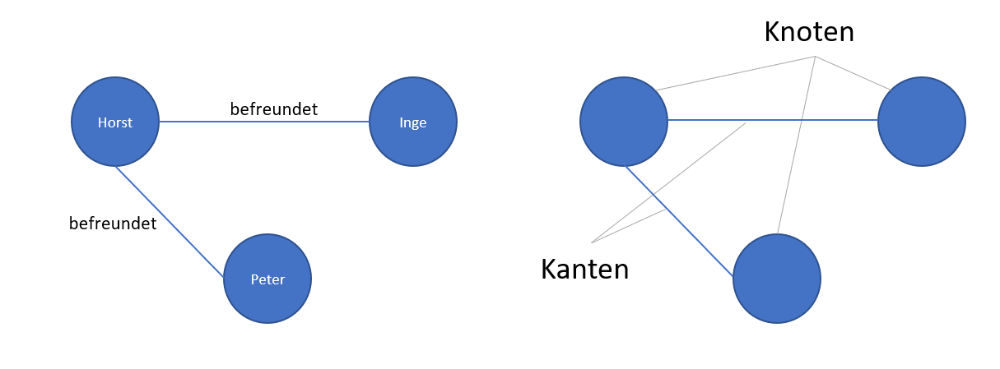
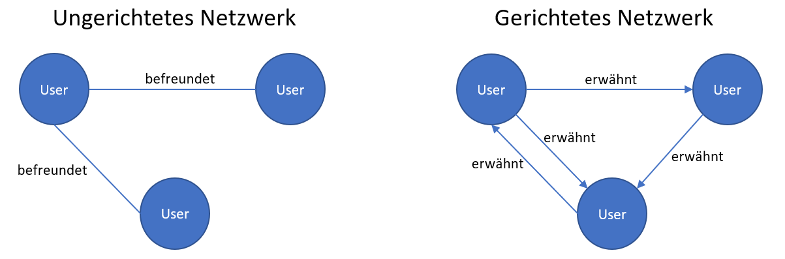
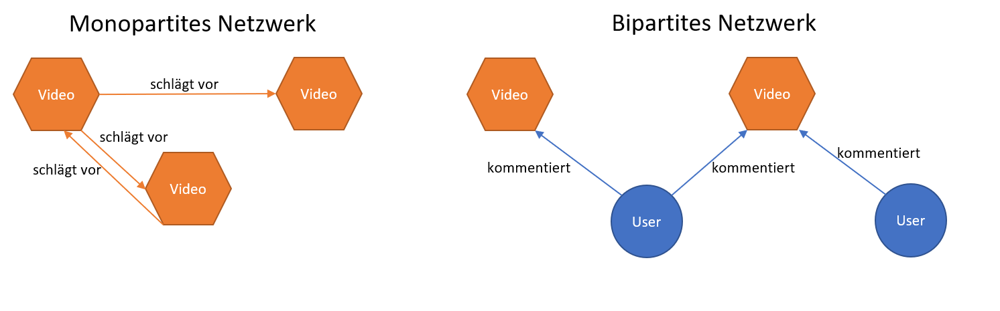

# Kurze Einführung in Netzwerke

Nertzwerke stellen eine spezifische Art der Abstraktion von Beziehungen zwischen Objekten dar. Prinzipiell lässt sich (fast) alles als ein Netzwerk darstellen. In der Soziologie, aus der das Konzept der Netzwerke stammt, ist ein Netzwerk klassischerweise ein Geflecht aus Beziehungen. Beispielsweise von Freund:innen, Verwandten oder Bekannten. Jeder Person stellt dabei einen sogenannten **Knoten (Nodes)** dar. Die Beziehung unter ihnen wird durch **Kanten (Edges)** repräsentiert.



Wir können auch zahlreiche andere Beziehungen als Netzwerke darstellen. Neben Freundschaft oder Verwandtschaft von Personen könnte es auch das gemeinsame Vorkommen von Wörtern in einem Dokument sein. Dabei ist es wichtig, zwischen **gerichteten** und **ungerichteten** Netzwerken zu unterscheiden. **Ungerichtete Netzwerke** sind solche, bei denen es keinen Sinn macht, eine "Richtung" anzugeben. Zwei Personen sind immer gleichermaßen miteinander befreundet oder verwandt. Ein einseitiges Verhältnis, bei dem Inge zwar mit Horst, Horst aber nicht mit Peter, oder Oma zwar mit Mutti, Mutti aber nicht mit Oma verwandt ist, gibt es nicht. **Bei ungerichteten Netzwerken haben die Kanten keine Richtung.** Anders ist es bei **gerichteten Netzwerken**. Dort ist es wichtig, wer mit wem interagiert. Horst schreibt Inge einen Brief, diese schreibt ihm aber keinen. Ein User in einem sozialen Netzwerk erwähnt einen anderen, dieser erwähnt ihn aber nicht. **Bei gerichteten Netzwerken ist die Richtung der Kanten entscheidend.**



Außerdem wird in der Regel zwischen **monopartiten** **Netzwerken** und **bipartiten Netzwerken** (manchmal auch *1-mode* und *2-mode* Netzwerke genannt) unterschieden. Bisher waren alle Netzwerke, die wir kennengelernt haben, monopartite Netzwerke. **Monopartite Netzwerke bestehen aus einem einzigen Knotentyp**. Also Usern, die einander erwähnen, Personen, die befreundet sind, Wörter, die gemeinsam vorkommen, usw. **Ein bipartites Netzwerk besteht aus zwei unterschiedlichen Knotentypen, wobei nur Knoten unterschiedlchen Typs in Beziehung stehen können.** Ein Beispiel wäre ein Netzwerk aus YouTube Videos und Userkommentaren. Während User Videos kommentieren können, können sie nicht direkt andere User kommentieren. Sie könnten zwar deren Kommentare kommentieren - aber das wäre wiederum eine andere Art von Netzwerk. Genausowenig können die Videos einander kommentieren. Sie könnten aufeinander über die vorgeschlagenen Videos verweisen, aber auch das wäre wieder ein anderes, monopartites Netzwerk. Es ist also wichtig, sich zu überlegen, auf welche Art und Weise man die Realität abstrahieren will und welcher Netzwerktyp dafür am geeignetsten ist.



Wir können Netzwerke auch **projizieren**. Das bedeutet, dass wir ein **bipartites in ein monopartites Netzwerk umwandeln**. Die indirekten Beziehungen zwischen Knoten eines Typs, welche immer über die Knoten des anderen Typs vermittelt sind, werden auf dieselbe Ebene **projiziert**. User:innen, die dasselbe Video kommentieren haben so eine Beziehung. Andersherum können wir mittels Projektion auch die Videos in direkte Beziehung setzen, die von denselben User:innen kommentiert wurden. Die so entstehenden Projektionen sind immer ungerichtet.


Schlussendlich können Netzwerke **gewichtet** oder **ungewichtet** sein. **In gewichteten Netzwerken haben die Kanten einen Wert, welcher der Stärker der Interaktionen zwischen zwei Knoten entspricht.** Beispielsweise die Häufigkeit, mit der ein User einen anderen erwähnt oder die Anzahl an Usern, die dasselbe Video komentieren. **Bei ungewichteten Netzwerken ist dieser Wert immer gleich, idr. 1.**

# Netzwerkanalyse in R

### Kommentare

Wir werden Netzwerkanalysen verwenden, um YouTube anhand ihrer Metadaten miteinander in Beziehung zu setzen. Innerhalb des *Tidyverse* können wir dazu die Pakete *tidygraph* und (zur Visualiserung) *ggraph* verwenden. Zunächst installieren wir diese und laden sie, gemeinsam mit dem *tidyverse* in unsere Umgebung. Für einige Funktionen brauchen wir außerdem *igraph*, auf das *tidygraph* aufbaut.

```{r}
install.packages("tidygraph")
install.packages("ggraph")
install.packages("igraph")

library(tidyverse)
library(igraph)
library(tidygraph)
library(ggraph)
```

Daraufhin laden wir die Daten aus dem Learnweb in unsere R Umgebung. Nachdem ihr sie heruntergeladen habt (und sichergestellt, dass euer *working directory* demselben Ordner entspricht, in dem ihr sie ablegt habt), können wir die Daten einlesen. Wir benötigen *party_comments_january* und (später) *related_videos_january* sowie *party_videos_january.*

```{r}
party_comments_january <- read_csv("party_comments_january.csv")

related_videos_january <- read_csv("related_videos_january.csv")

party_videos_january <- read_csv("party_videos_january.csv")
```

Zunächst müssen wir aus unseren Daten einen **Netzwerkgraphen** machen. Dazu nutzen wir `as_tbl_graph()`, das aus einem Dataframe oder Tible einen Graphen macht. Da wir uns für die User:innen interessieren, die Parteivideos kommentieren, sind die beiden **Nodetypen** die *video_id* und der *authorDisplayName*, also der Name der User:in. Wir könnten auch einen Graphen erstellen, der von *video_id* zu *comment_id*, also dem einzelnen Kommentar geht. Oder einen Graphen, der direkt von der Partei, die ein Video gepostet hat, zu den User:innen geht. Bei allen drei Netzwergraphen handelt es sich um **bipartite Netzwerke**. Da wir daran interessiert sind, wie sich Userkommentare um Videos (auch derselben Partei) gruppieren, wählen wir *video_id* und *authorDisplayName.*

`as_tbl_graph()` nimmt dabei immer die ersten beiden Spalten eines Dataframe/Tibble als Beziehung, wobei jede Reihe des Dataframes einen Node darstellt. Also ein Dataframe mit *Spalte A* und *Spalte B* wird zu *Node_A1 -\> Node_B2, Node_A2 -\> Node_B2* usw. In unserem Fall also die Beziehung von *authorDisplayName* zu *video_id*. Mittels `select()` können wir die benötigten Spalten (und nur diese!) auswählen und in die richtige Reihenfolge bringen. Da außerdem für einige Kommentare der Name der Autor:in zu fehlen scheint, filtern wir diese Einträge zunächst raus. Andernfalls würden wir eine Warnmeldung erhalten.

```{r}
comments_graph <- party_comments_january %>% 
  filter(!is.na(authorDisplayName)) %>% 
  select(authorDisplayName, video_id) %>% 
  as_tbl_graph(directed = TRUE)
```

Mit `ggraph()` können wir unser Netzwerk jetzt visualisieren. Ähnlich wie bei `ggplot` können wir zeilenweise Funktionen und Visualisierungen hinzufügen. Für Graphen müssen wir jedoch **Nodes** und **Edges** einzeln hinzufügen. Beispielsweised `geom_edge_arc()` für geschwungene Kanten, deren Farbe wir auch festlegen können, und Punkte für die Knoten via `geom_node_point()`. Außerdem müssen wir ein **Layout** wählen, das berechnet, wie diese am besten angeordnet werden. Hinweis: die Berechnung des Layouts kann etwas Zeit in Anspruch nehmen!

```{r}
ggraph(comments_graph, layout = "fr") +
  geom_edge_arc(color = "lightgrey") +
  geom_node_point()
```

Das wirkt noch etwas chaotisch. Außerdem sehen wir, dass wir zwei *Outlier* haben, die keine Verbindungen zu den restlichen Knoten zu besitzen scheinen. Da wir daran interessiert sind, welche User mehrere Videos kommentieren, können wir den Graph entsprechend filtern. Dazu machen wir uns den sogenannten **Degree** zunutze. Dieser zählt die Anzahl an Kanten (bzw. die addierten Gewichte bei gewichteten Graphen), die von einem Knoten ein- oder ausgehen. **Der Indegree zählt die eingehenden, der Outdegree die ausgehenden Verbindungen.** Wir sind also nur an Videos interessiert, die einen **Indegree** von mindestens 2 haben (also mindestens zweimal kommentiert werden) und User:innen, die einen **Outdegree** von mindestens 2 haben (also mindestens zweimal kommentieren).

Mit *tidygraph* können wir nicht nur den Degree berechnen, sondern auch `filter()` nutzen, um wie bei Dataframes zu filtern. Um den Degree zu berechnen, müssen wir jedoch zunächst die Nodes "aktivieren", damit *tidygraph* weiß, dass der folgende `mutate()` Befehl sich auf die Knoten und nicht die Kanten bezieht. Hinweis: da in unserem bipartiten Netzwerkgraphen User:innen immer nur einen Outdegree haben können (da nur sie kommentieren können) und Videos immer nur einen Indegree (da sie nur kommentiert werden können und nicht selbst kommentieren), reicht es den gesamten Degree - statt In- und Outdegree getrennt - zu berechnen.

```{r}
comments_subgraph <- comments_graph %>% 
  activate(nodes) %>% 
  mutate(degree = centrality_degree(mode = "total")) %>% 
  filter(degree > 2)
  
ggraph(comments_subgraph, layout = "fr") +
  geom_edge_arc(color = "lightgrey") +
  geom_node_point()
```

Schon besser! Wir würden nun gerne noch vermerken, welches Video von welcher Partei gepostet wurde. Diese Information können wir als sogenannten *Node Attribute*, also Knotenattribut, hinzufügen. Dazu müssen wir zunächst einen Datensatz erstellen, dessen Partei-Variable wir daraufhin unserem Graph mit `left_join()` hinzufügen. Diesen Datensatz erstellen wir quasi im vorübergehen, indem wir zunächst *video_id* und *party_label* aus dem ursprünglichen Kommentar-Datensatz auswählen. Diesem werden dann die Namen aller Autoren als Reihen hinzugefügt. Da diese keiner Partei angehören, setzen wir das *party_label* dort als *NA*, also fehlend. Da wir außerdem auf die *name* Variable des Graphen joinen, bennen wir *video_id* bzw. *authorDisplayName* entsprechend um. Vor dem letztendlichen *join* stellen wir noch mit `distinct()` sicher, dass jeder Autorenname und jede Video ID nur einmal vorkommt.

```{r}
comments_subgraph <- comments_subgraph %>% 
  left_join(party_comments_january %>% select(video_id, party_label) %>% 
              rename(name = video_id) %>% 
              bind_rows(party_comments_january %>% 
                          select(authorDisplayName) %>% 
                          rename(name = authorDisplayName) %>% 
                          mutate(party_label = NA)) %>% 
              distinct(),
            by = "name")
```

Außerdem wollen wir noch vermerken, ob es sich bei einem Knoten um eine User:in oder ein Video handelt. Da alle User:innen ein `NA` als Partei-Variable haben, können wir den Typ für alle Knoten mit fehlendem Partei-Attribut auf "User", für alle anderen auf "Video" setzen. Dazu nutzen wir erneut `activate()` und `mutate()`, sowie `case_when()` um festzulegen, in welchem Fall (*party_label* ist `NA` oder nicht) welcher Wert eingetragen werden soll.

```{r}
comments_subgraph <- comments_subgraph %>% 
  activate(nodes) %>% 
  mutate(type = case_when(is.na(party_label) ~ "user",
                          !is.na(party_label) ~ "video"))
```

Jetzt können wir unseren Graphen erneut visualisieren. Diesmal können wir jedoch die Partei als Farbe hinzufügen und den Typ als Knotenform. Außerdem können wir die Größe der Knoten als proportional zum Degree (Anzahl gemachter/erhaltener Kommentare) festlegen.

```{r}
ggraph(comments_subgraph, layout = "fr") +
  geom_edge_arc(color = "lightgrey") +
  geom_node_point(aes(color = party_label, shape = type, size = degree))
```

Wie auch bei `ggraph()` können wir weitere Anpassungen vornehmen. So können wir erneut die klassischen Parteifarben angeben. Wir können aber auch die Formen bestimmen, die die Knoten (je nach Typ) annehmen. Außerdem können wir auch hier die Label und den Titel festlegen.

```{r}
colors <-
  c(
    "AfD" = rgb(0, 60, 145, maxColorValue = 255),
    "CDU" = rgb(50, 48, 46, maxColorValue = 255),
    "DIE LINKE" = rgb(182, 28, 62, maxColorValue = 255),
    "FDP" = rgb(255, 237, 0, maxColorValue = 255),
    "Bündnis 90/Die Grünen" = rgb(70, 150, 43, maxColorValue = 255),
    "SPD" = rgb(227, 0, 15, maxColorValue = 255)
  )

ggraph(comments_subgraph, layout = "fr") +
  geom_edge_arc(color = "lightgrey") +
  geom_node_point(aes(color = party_label, shape = type, size = degree)) +
  scale_shape_manual(values = c(4, 16)) +
  scale_color_manual(values = colors) +
  labs(color = "Partei", shape = "Typ", size = "Degree",
       title = "Kommentare auf Parteivideos", 
       caption = "Begrenzt auf Nutzer*innen, die 2 oder mehr Kommentare verfasst haben")
  
```

### Vorgeschlagene Videos

Um die vorgeschlagenen Videos als Netwzerk darzustellen, können wir ähnlich vorgehen. Zunächst erstellen wir ein Netzwerk zwischen den Videos, bei dem eine Verbindung darstellt, um ein Video von einem anderen vorgeschlagen wird - oder auch nicht. Da wir in diesem Netzwerk nur den Knotentyp "Video" haben, handelt es sich, im Gegensatz zu dem Video-Kommentar-Graphen oben, um ein **monopartites Netzwerk**. Auch hier wählen wir zunächst die relevanten Variablen und deren Reihenfolge mit `select()` aus, bevor wir mit `as_tbl_graph()` einen Netzwerkgraphen bilden. Hier also einen **gerichteten** Graphen von Video ID zur ID des vorgeschlagenen Videos.

```{r}
related_graph <- related_videos_january %>% 
  select(video_id, rel_video_id) %>% 
  as_tbl_graph(directed = TRUE)
```

Erneut können wir unseren Graphen einfach mit `ggraph()` visualisieren:

```{r}
ggraph(related_graph, layout = "fr") +
  geom_edge_arc(color = "lightgrey") +
  geom_node_point()
```

Außerdem möchten wir wissen, welche Knoten - also welche Videos - die höchste **Betweenness** aufweisen. Diese berechnet, wieviele kürzeste Pfade von einem beliebigen Knoten zu einem beliebigen anderen Knoten führen. Je mehr kürzeste Pfade durch einen Knoten führen, desto *zentraler* ist er im Netzwerk. Mit anderen Worten: An einem Knoten mit hoher **Betweenness** gibt es quasi kein Vorbeikommen. Wenn wir uns von einem Knoten zu einem anderen bewegen - etwa, wenn wir uns durch die vorgeschlagenen Videos klicken - werden wir früher oder später wahrscheinlich auf einen solchen Knoten stoßen.

Ähnlich wie oben den Degree, können wir *tidygraph* verwenden, um die betweenness zu berechnen. Diesmal filtern wir jedoch nicht, da wir unser Netzwerk nicht verkleinern möchten.

```{r}
related_graph <- related_graph %>% 
  activate(nodes) %>% 
  mutate(betweenness = centrality_betweenness())
```

Nun können wir uns die Videos mit der höchsten Betweenness anzeigen lassen. Um den Titel des Videos zu erhalten, können wir erneut `join_by()` verwenden, um in aus unserem ursprünglichen Datensatz zu ziehen. Zunächst wandeln wir mittels `activate()` und `as_tibble()` jedoch den Graphen in eine Tibble um. Für den join benennen wir zunächt den Namen wieder in ID um und wählen aus unserem ursprünglichen Datensatz nur jene Variablen aus, die wir auch brauchen - nämlich ID und Titel des Videos sowie den Namen das Kanals, der das Video hochgeladen hat. Schlussendlich können wir noch `arrange()` verwenden, um den Datensatz mittels `desc()` nach absteigender Betweenness zu sortieren. So sehen wir schneller, welche Videos relevant sind.

```{r}
related_graph %>% 
  activate(nodes) %>% 
  as_tibble() %>% 
  rename(video_id = name) %>% 
  left_join(related_videos_january %>% select(video_id, title, channelTitle),
            by = "video_id") %>% 
  arrange(desc(betweenness))
```

Schlussendlich können wir auch diesen Graphen noch eimal hübscher darstellen. Dafür verwenden wir wieder die Parteifarben, wobei wir die Partei analog zum Vorgehen oben zuerst als Knotenattribut anbringen müssen.

```{r}
related_graph <- related_graph %>% 
  left_join(party_videos_january %>% select(contentDetails.videoId, party_label) %>% 
              rename(name = contentDetails.videoId),
            by = "name")
```

Statt dem Degree verwenden wir diesmal jedoch die Betweenness, um die Größe der Knoten festzulegen.

```{r}
ggraph(related_graph, layout = "fr") +
  geom_edge_arc(color = "lightgrey") +
  geom_node_point(aes(color = party_label, size = betweenness)) +
  scale_color_manual(values = colors) +
  labs(color = "Partei", size = "Betweenness",
       title = "Vorgeschlagene Videos zwischen Parteien")
```
