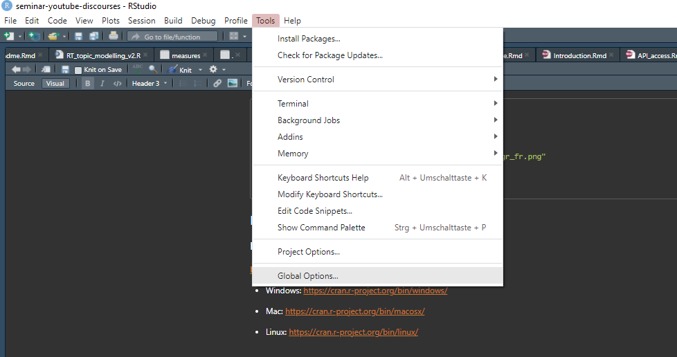
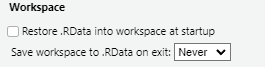
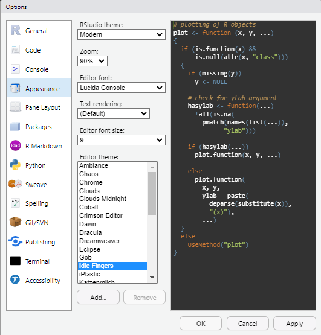
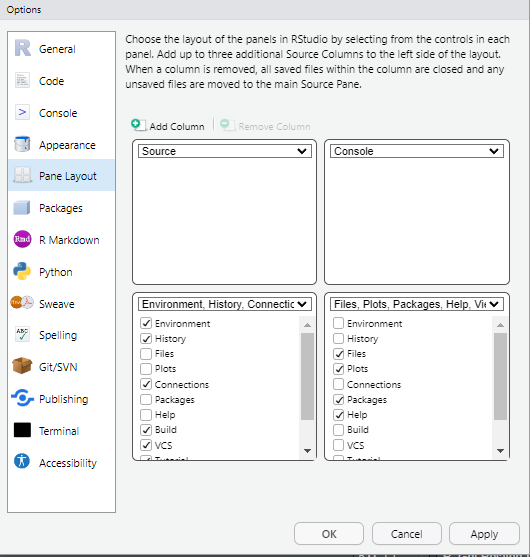
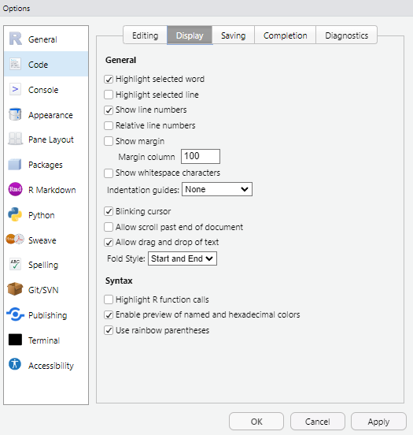
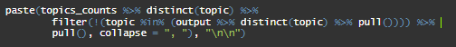
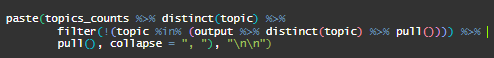
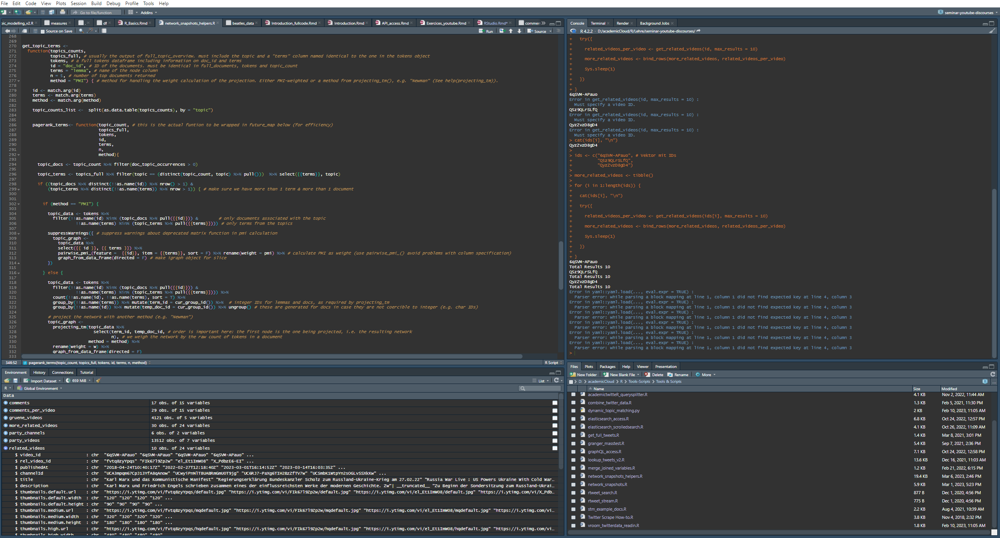

## R & RStudio installieren

### **R**

[**https://cran.r-project.org/**](https://cran.r-project.org/){.uri}

-   Windows: <https://cran.r-project.org/bin/windows/>

-   Mac: <https://cran.r-project.org/bin/macosx/>

-   Linux: <https://cran.r-project.org/bin/linux/>

### **RStudio**

[**https://posit.co/download/rstudio-desktop/**](https://posit.co/download/rstudio-desktop/){.uri}\

## Einstellungen

## Workspace

Zur Reproduzierbarkeit von Daten ist es besser, RStudio immer "clean", d.h. ohne Daten zu starten. So muss der Code jedesmal neu aufgerufen werden, um Ergebnisse zu produzieren. Zwischenergebnisse müssen per Hand gespeichert werden. So ist sichergestellt, dass der Code reproduzierbar ist!

## Aussehen / Themes

## Anordnung der Fenster

## Regenbogenklammern

## Regenbogenklammern: Beispiel

 

## Elemente von RStudio

{width="800"}

## Shortcuts

`strg + ENTER` (im Script/Notebook): aktuelle Zeile Code abspielen

`strg + PfeilOben` (in Console): letzte Befehle (nur Pfeil nach oben = letzter Befehl)

`strg + shift + m`: Pipe einfügen (***%\>%***)

`tab`: Vorschläge anzeigen (beim tippen von Funktionen oder Pfaden)

`strg + s`: aktuelles Script/Notebook speichern

`strg + klick`: Klickl auf Objekt im Skript/Notebook zeigt das Objekt an. Funktionier auch für Funktionen!

`alt + shift + k`: Alle Shortcuts anzeigen
