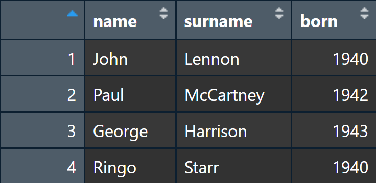

```{r setup, include=FALSE}
knitr::opts_chunk$set(echo = TRUE,  comment = '')
library(tidyverse)
```

## *R*

-   freie Softwareumgebung
-   flexible Anwendungsmöglichkeiten, u.a. Statistik, Textverarbeitung, Visualisierung, Netzwerkanalyse, API-Zugriff, Webscraping, Interaktive Anwendungen....
-   Zahlreiche Funktionen werden über sogenannte "Packages" bereitgestellt
-   vergleichbar mit *Python*, allerdings mit Wurzeln in der statistischen Analyse - daher ein leicht engerer Fokus, welcher *R* insbesondere in den Sozial- und Politikwissenschaften beliebt macht
-   Ähnlich wie in *Python* werden in *R* **Funktionen** auf **Objekte** angewendet, um diese zu manipulieren


## *R*: weitere Funktionen 

-   **R Studio** IDE (*Integrated Development Environment*) ermöglicht u.a. komfortables anlegen von Scripts, Inspektion von Objekten, Öffnen von Help-Files sowie das Anzeigen von Grafiken und Graphen
-   **RMarkdown** ermöglicht das komfortable anlegen von Dokumentationen, Berichten oder Präsentation (wie dieser hier), die auf R-Code basieren


# Programmieren mit *R*

## R als Taschenrechner

```{r}
1 + 4
```

```{r}
(1230 + log(1238) * 5) ^ 2 
```

## Objekte

**Zuordnen von Objekten**

```{r}
x <- 2
x
```

```{r}
x + 5
```

## Objekte

**Überschreiben von Objekten**

```{r}
x <- 7
x
```

**Neuzuordnungen**

```{r}
y <- x + 5
y
```

<!-- ## Objekttypen -->

<!-- ```{r} -->
<!-- numerisches_objekt <- 4 -->
<!-- numerisches_objekt -->
<!-- ``` -->

<!-- ```{r} -->
<!-- text_objekt <- "ein Objekt voll Text" -->
<!-- text_objekt -->
<!-- ``` -->

<!-- ```{r} -->
<!-- logisches_objekt <- TRUE -->
<!-- logisches_objekt -->
<!-- ``` -->

<!-- ## Objekttypen -->

<!-- ```{r} -->
<!-- datum <- as.Date("2023-03-10") -->
<!-- datum -->
<!-- ``` -->

<!-- ## Objekttypen ändern -->

<!-- ```{r} -->
<!-- z <- "25" -->
<!-- z -->
<!-- is.character(z) -->
<!-- ``` -->

<!-- ## Objekttypen ändern -->

<!-- ```{r} -->
<!-- z <- as.numeric(z) -->
<!-- z -->
<!-- is.character(z) -->
<!-- is.numeric(z) -->
<!-- ``` -->

## Fehlende Werte: NA

```{r}
missing <- NA
missing
is.na(missing)
```

<!-- ## Fehlende Werte: NULL -->

<!-- ```{r} -->
<!-- is.null(missing) -->
<!-- nothing <- NULL -->
<!-- is.na(nothing) -->
<!-- ``` -->

<!-- NULL bezeichnet undefinierte Werte, welche nicht evaluiert werden können. NULL kann kein Teil anderer Datenstrukturen, z.B. Vektoren sein (NULL wird bei der Zuordnung ignoriert). NA kann hingegen Teil anderer Datenstrukturen sein, um fehlende Werte anzuzeigen. -->

## Datenstrukturen I: Vektoren

Vektoren sind Objekte mit mehreren Werten, wobei diese Werte vom selben Typ (numerical, character, etc) sein müssen

```{r}
numbers_vector <- c(1,2,3,8,76,9)
numbers_vector
```

```{r}
numbers_vector[5]
```

```{r}
numbers_vector[5] * 2
```

## Datenstrukturen I: Vektoren

```{r}
numbers_vector * 2
```

```{r}
length(numbers_vector)
```

```{r}
sum(numbers_vector)
```

```{r}
mean(numbers_vector)
```

## Datenstrukturen II: Listen

Listen beinhalten ebenfalls mehrere Werte. Sie können jedoch unterschiedliche Objekttypen und sogar weitere Objekte mit mehreren Objekten, z.B. eine weitere Liste, als Werte enthalten. Auf ihnen kann jedoch, um Unterschied zu Vektoren, nicht direkt operiert werden.

```{r}
my_list <- list(1, 3, 5)
my_list
```

<!-- ## Datenstrukturen II: Listen -->

<!-- ```{r} -->
<!-- my_fancy_list <- list(c(1,2,5), 43, "what a list!", list(TRUE, 42)) -->
<!-- my_fancy_list -->
<!-- ``` -->

<!-- ## Datenstrukturen II: Listen -->

<!-- ```{r, error=T} -->
<!-- sum(my_list) -->
<!-- ``` -->

<!-- ```{r} -->
<!-- sum(my_fancy_list[[1]]) -->
<!-- ``` -->

## Datenstrukturen III: Dataframes

Dataframes kombinieren (im Gegensatz zu Listen) **gleich lange** Vektoren unterschiedlichen Typs. Sie sind (grob) vergleichbar mit Tabellen in z.B. Excel

```{r}
beatles_data <- data.frame(
  name = c("John", "Paul", "George", "Ringo"),
  surname = c("Lennon", "McCartney", "Harrison", "Starr"),
  born = c(1940, 1942, 1943, 1940)
)
beatles_data
```

## Datenstrukturen III: Dataframes

```{r, eval = F}
View(beatles_data) # Ansehen des Dataframes im Viewer
```

```{r, echo=FALSE, fig.cap="", out.height="80%", out.width="80%"}

```

## Datenstrukturen III: Dataframes

```{r}
mean(beatles_data$born)
```

```{r}
nrow(beatles_data) # Anzahl Reihen
```

```{r}
length(beatles_data) # Anzahl Spalten
```

```{r}
dim(beatles_data) # Anzahl der Reihen und Anzahl der Spalten
```

## Datenstrukturen III: Dataframes

```{r}
names(beatles_data) # Namen der Spalten
```

```{r}
str(beatles_data) # Struktur des Dataframes
```

## Das Tidyverse

```{r, eval=F}
install.packages("tidyverse") # Installation eines Packages
library(tidyverse) # Laden eines Packages
```

-   Sammlung an Packages dar, die nach denselben Prinzipien operieren und entsprechend kompatibel sind
-   effiziente und konsistentere Alternative zur Verwendung gängiger R-Basis-Operationen dar, z.B. zur Datenmanipulation oder Visualisierung
-   **eine** Art, R zu verwenden
-   Häufig finden sich Mischungen des *tidy*-Syntax und des *base*-Syntax

## Das Tidyverse

Das *Tidyverse* beruht auf dem *tidy data*-Prinzip:

```{r, echo=FALSE, fig.cap="https://r4ds.hadley.nz/data-tidy.html#fig-tidy-structure", out.height="100%", out.width="100%"}
knitr::include_graphics("tidy-1.png")
```

## Vergleich von *Base R* und *Tidyverse*

**Base R: Multiple Objekte**
Hinweis: "Iris" ist ein Testdatensatz, welcher in R immer verfügbar ist

```{r}
data <- iris 
subset <- data[data$Sepal.Length > 7, ]
mean_width <- mean(data$Sepal.Width)
sub_subset <- subset[subset$Sepal.Width > mean_width,]
result <- sum(sub_subset$Petal.Width)
result
```

## Vergleich von *Base R* und *Tidyverse*

**Alternative in Base R: verschachtelte Funktionen**

```{r}
result <- sum(data[data$Sepal.Length > 7 &
                     data$Sepal.Width > mean(data$Sepal.Width), 
                   "Petal.Width"])
result
```

## Vergleich von *Base R* und *Tidyverse*

**Tidyverse: *Pipe* **

```{r}
result <- data %>% 
  filter(Sepal.Length > 7) %>% 
  filter(Sepal.Width > mean(Sepal.Width)) %>% 
  pull(Petal.Width) %>% 
  sum()
result
```

## Anwendungsbeispiel Tidyverse: Data Wrangling I

Wir wollen die Höchstwerte der Blütenlänge für jede Spezies im *Iris*-Datensatz, wobei nur Exemplare mit überdurchschnittlicher Blütenbreite berücksichtigt werden sollen

```{r}
iris %>% 
  group_by(Species) %>% # Gruppierung 
  filter(Petal.Width > mean(Petal.Width)) %>% # Filterung 
  slice_max(Petal.Length, n = 1) # Höchstwerte 
```

## Anwendungsbeispiel Tidyverse: Data Wrangling II

Durschnittliche Blütenbreite pro Spezies

```{r}
iris %>% 
  group_by(Species) %>% 
  summarise(mean_Petal.Width = mean(Petal.Width))
```


## Visualisierung mit dem Tidyverse: *ggplot2*

ggplot verwendet **+** statt der Pipe ( %\>% )

```{r, eval=F}
ggplot(iris,
       # festlegen der Variablen mit aes()
       aes(x = Petal.Length, y = Petal.Width, color = Species)) + 
  # festlegen des Plot Typs. Hier: Linie
  geom_line() + 
  # Optional: Verwendung eines anderen Farbthemas 
  theme_bw() + 
  # Optional: manuelle Beschriftung
  labs(
    x = "Blütenblattlänge",
    y = "Blütenblattbreite",
    color = "Gattung",
    title = "Blütenlänge- und Breite nach Gattung"
  ) 
```

## Visualisierung mit dem Tidyverse: *ggplot2*

```{r, echo=F}
ggplot(iris,
       # festlegen der Variablen mit aes()
       aes(x = Petal.Length, y = Petal.Width, color = Species)) + 
  # festlegen des Plot Typs. Hier: Linie
  geom_line() + 
  # Optional: Verwendung eines anderen Farbthemas (für den Hintergrund etc.)
  theme_bw() + 
  # Optional: manuelle Beschriftung
  labs(
    x = "Blütenblattlänge",
    y = "Blütenblattbreite",
    color = "Gattung",
    title = "Blütenlänge- und Breite nach Gattung"
  )
```

## Addendum: Was tun, wenn unser Code nicht funktioniert?

**Frag das Internet!**

-   Fehlermeldung suchen auf Google, Duckduckgo...
-   Nach dem Problem auf <https://stackoverflow.com/> **suchen** oder nach der Lösung **fragen**
-   Die Seite des Packages aufsuchen: idR. auf github.com - dort unter "Issues" suchen oder fragen, z.B. <https://github.com/tidyverse/dplyr/issues>

**Außerdem:**

`?function` oder `help(function)`, z.B. `?summarise`, öffnet die Hifeseite einer Funktion in RStudio
